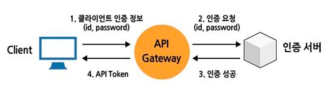
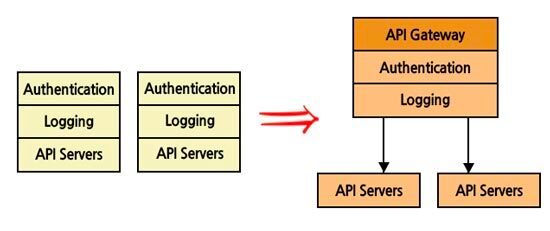
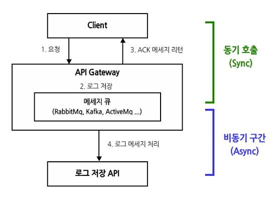

## Section 02: API Gateway Service

#### 목차

01. API Gateway Service 
02. Netflix Ribbon 과 Zuul 
03. Spring Cloud Gateway 개념

### [1] API Gateway Service

최근 많은 서비스들이 독립적인 기능을 수행하는 작은 단위의 서비스들로 구성된 `마이크로 서비스 아키텍처(Micro Service Architecture)` 형태로 구축되면서 서비스의 복잡도를 줄일 수 있게 되었고, 변경에 따른 영향을 최소화하면서 개발과 배포를 할 수 있다는 장점도 얻게 되었다.
 
하지만 여기서 말하는 작은 단위의 서비스가 50개, 100개가 되었을 때, 이 많은 서비스들의 엔트포인트를 관리하는 데 있어서 어려움이 생기고, 또 각각의 서비스마다 공통적으로 들어간느 기능(예를 들어 인증/인가, 로깅 등)들을 중복으로 개발해야한다는 문제점이 발생한다.
 

이러한 문제점을 해결하기 위해 등장한 것이 바로 `API Gateway` 로 해당 시스템은 상단의 이미지와 같이 클라이언트와 각각의 서비스들 중간에 위치한다.
 사용자가 설정한 라우팅 설정에 따라서 각각의 엔드 포인트로 클라이언트 대신 요청하고 다시 클라이언트에게 응답할 수 있다. 
시스템의 내부 구조를 숨기고 외부 클라이언트의 요청에 대해서 적절한 형태로 응답할 수 있는 장점을 가진다.
`API Gateway` 는 이외에도 다양한 기능 및 장점을 가진다.

- `인증/인가 및 토큰 발급` 
먼저 인증/인가의 경우, 일반적으로 각 서비스마다 공통으로 구현되어야 하는 필수적 기능이다. 
각각의 서비스마다 인증/인가를 구현하는 것은 매우 비효율적이기 때문에 API Gateway 에서 해당 처리를 하면 된다.

또한 API 사용을 위한 Token 발급 기능도 마찬가지로 API Gateway 에서 처리한다.
**(일반적으로는 Jwt 관련 filter)**
실제로 토큰 발급 기능은 인증을 위한 서비스(=인증 서버)을 하나 두고 거기에서 처리하게 된다.

- `공통 로직 처리`  
앞에서 살펴본 인증/인가 외에도 여러 서비스에서 공통적으로 처리해야 할 기능들이 있다.
MSA 아키텍처에서 모든 서비스마다 해당 기능을 위한 코드를 구현하는 건 유지보수 측면에서 매우 비효율적이다.
따라서 앞단에 API Gateway 을 두어 거기서 공통 로직을 처리하게 된다.

해당 이미지는 `인증(Authentication)`,`로깅(Logging)` 등의 공통 기능을 처리하는 API Gateway 을 나타낸다.
이러한 구조는 개발 중복 또한 줄여주어 개발자의 수고를 덜어준다.
(**최근 API 호출 로킹을 통해 API 호출 패턴을 분석하여 활용하려는 것은 빅데이터 측면에서 매우 중요** ❗️)

- `로드밸런싱`
API Gateway 는 대용량 분산 처리 서비스에서 `로드밸런싱` 역할도 가능하다.
API 서버에 장애가 발생했을 때 이를 감지해서 `로드밸런싱` 리스트에서 빼고, 복구되었을 때 다시 리스트에 넣는 기능들을 가진다(**Health-Check**)

- `매디에이션 기능`
메디에이션 기능 중에는 `메세지 호출 변화` 가 있다. 
쉽게 말해 동기,비동기 와 같은 API 호출하는 패턴을 변화하는 것인데, API Gateway 을 통해 메디에이션 기능을 수행할 수 있다.

이뿐만 아니라, 클라이언트의 요청을 하위 서비스가 처리할 수 있도록 데이터 형식을 변형하거나, 하위 서비스의 응답 표준 포맷으로 데이터 형식을 변형하는  
`메세지 포맷 변환` 기능도 있다.