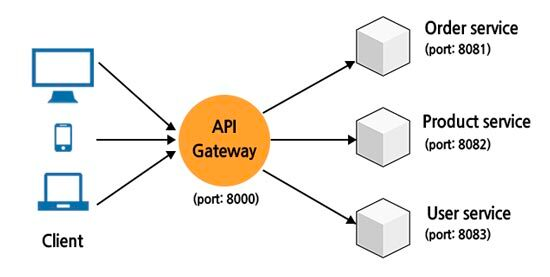

## Section 02: API Gateway Service

#### 목차

01. API Gateway Service 
02. Netflix Ribbon 과 Zuul 
03. Spring Cloud Gateway 개념

### [1] API Gateway Service

최근 많은 서비스들이 독립적인 기능을 수행하는 작은 단위의 서비스들로 구성된 `마이크로 서비스 아키텍처(Micro Service Architecture)` 형태로 구축되면서 서비스의 복잡도를 줄일 수 있게 되었고, 변경에 따른 영향을 최소화하면서 개발과 배포를 할 수 있다는 장점도 얻게 되었다.
 
하지만 여기서 말하는 작은 단위의 서비스가 50개, 100개가 되었을 때, 이 많은 서비스들의 엔트포인트를 관리하는 데 있어서 어려움이 생기고, 또 각각의 서비스마다 공통적으로 들어간느 기능(예를 들어 인증/인가, 로깅 등)들을 중복으로 개발해야한다는 문제점이 발생한다.
 

이러한 문제점을 해결하기 위해 등장한 것이 바로 `API Gateway` 로 해당 시스템은 상단의 이미지와 같이 클라이언트와 각각의 서비스들 중간에 위치한다.
 사용자가 설정한 라우팅 설정에 따라서 각각의 엔드 포인트로 클라이언트 대신 요청하고 다시 클라이언트에게 응답할 수 있다. 
시스템의 내부 구조를 숨기고 외부 클라이언트의 요청에 대해서 적절한 형태로 응답할 수 있는 장점을 가진다.
`API Gateway` 는 이외에도 다양한 기능 및 장점을 가진다.

- 인증/인가 및 토큰 발급
